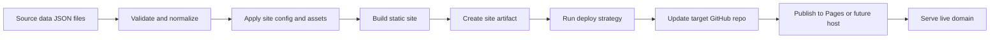
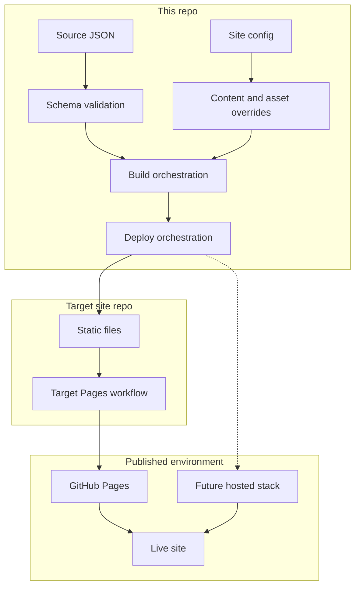
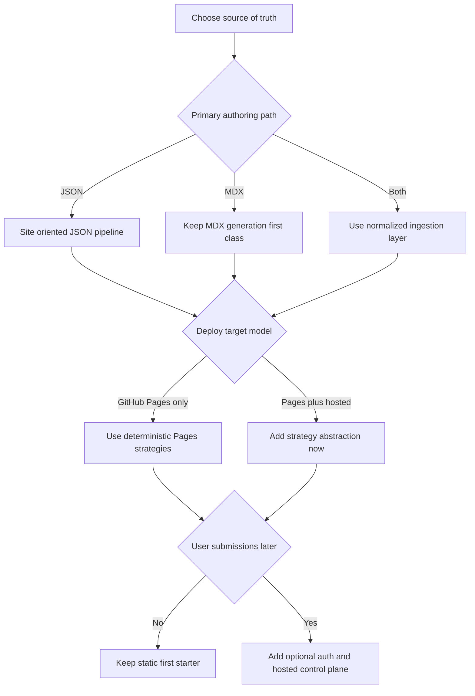

# Next Planning Pass

## Goal

Turn the current `serpdownloaders.com` proof of concept into a deterministic, reusable multi-site build and deploy system without losing the starter-template cleanup already underway.

Execution tracking for this branch lives in [docs/IMPLEMENTATION_TRACKER.md](/Users/devin/dev/repos/json-directory-template/docs/IMPLEMENTATION_TRACKER.md).

## Visual Map

### End-to-end flow

### Responsibility boundaries

### Planning phases

### Early decision points

## What we have now

- [x] One working proof that source JSON can be validated, transformed, built here, and deployed to another GitHub repo for GitHub Pages
- [x] A static export build path via `pnpm build:pages`
- [x] A target-repo sync deploy path via `scripts/deploy-to-repo.sh`
- [x] A checked-in site config for `serpdownloaders`
- [x] Site-aware validate/build/deploy commands driven by one site id
- [x] Per-site build artifacts under `dist/sites/<site-id>`
- [x] Internal docs for the current Pages/export flow
- [x] Starter-shell feature flags so site-specific sidecar sections can be deterministic and opt-in
- [x] A checked-in site config model via `sites/site-config.default.ts` plus `sites/<site-id>/site-config.ts`
- [x] A clean split between canonical checked-in site inputs under `sites/**` and temporary intake under `tmp/sites/**`
- [x] An audit of what the current starter already treats as configurable vs what still needs to move into the site/build contract
- [x] A field-type pass for the active build contract:
      boolean vs enum vs free text vs URL vs file reference vs provider payload
- [x] A cleaner operator-facing DR badge input shape:
      provider-style payload first, raw badge fields only as compatibility
- [x] A first classification pass for starter defaults vs site-owned content vs contract-driven surfaces
- [x] A working checked-in site-config build and deploy trial for `serpdownloaders`

## Where we are now

- [x] The static multi-site path is in a usable state:
      checked-in site config -> validate -> build -> deploy
- [x] The operator workflow is defined:
      maintain `sites/site-config.default.ts` plus `sites/<site-id>/site-config.ts`, keep canonical assets/data beside that site config, then run validate/build/deploy
- [x] The build contract is now explicit enough to keep expanding without mixing internal implementation details into operator inputs
- [x] The starter cleanup pass is far enough along that the remaining work is mostly:
      optional hosted/product direction, deeper content ownership decisions, and follow-up polish

## Current recommended source of truth for status

- [x] [docs/IMPLEMENTATION_TRACKER.md](/Users/devin/dev/repos/json-directory-template/docs/IMPLEMENTATION_TRACKER.md)
      is the current execution/status doc
- [x] This file is the higher-level roadmap and should stay in sync with the tracker, not compete with it
- [x] [BUILD_PIPELINE.md](/Users/devin/dev/repos/json-directory-template/docs/BUILD_PIPELINE.md)
      is the current static-first pipeline doc and boundary statement

## First step before finalizing the plan

### 0. Plan-shaping audit against target state

- [x] Run a focused plan-shaping audit against the target outcome:
      deterministic multi-site build and deploy template for directory sites
- [x] Capture only plan-shaping findings now:
      source-of-truth assumptions, single-site build/deploy assumptions, hardcoded starter defaults, and workflow/docs mismatches
- [x] Update this plan with any findings that would change scope, phase order, or issue structure
- [x] Include test tasks and doc update tasks in the audit output so plan changes do not become code-only work
- [x] Decide which audit findings are:
      immediate cleanup, deferred cleanup, or reference-only legacy
- [x] Leave detailed cleanup inventory for a later implementation audit sweep once branch work starts

## Main planning tracks

### 1. Multi-site build and config flow

- [x] Define the checked-in site config convention for `sites/site-config.default.ts` plus `sites/<site-id>/site-config.ts`
- [x] Define the minimum required fields for the checked-in site config:
      target repo, branch, deploy strategy, source JSON path, domain, brand config, content overrides, asset overrides
- [x] Replace one-off env-driven site overrides with a deterministic checked-in site config loader
- [x] Move from one shared output folder to per-site output such as `dist/sites/<site-id>/`
- [x] Separate validate, build, and deploy into explicit site-aware commands
- [x] Replace single-site trial naming such as `TRIAL_SOURCE_JSON` with generic site-aware inputs
- [x] Decide where per-site assets, page-content overrides, and auxiliary site files live and how they are staged into each build
- [x] Consolidate the canonical build contract into the checked-in site config model instead of a separate build manifest layer
- [x] Define how target repo requirements are managed:
      preserved files, Pages workflow, CNAME, branch/path assumptions
- [x] Add a dry-run deploy mode that shows what would be pushed to the target repo
- [x] Decide whether one workflow run should build one site only or support controlled multi-site batches later
- [x] Define how non-website generated artifacts such as search indexes and feeds become site-aware
- [x] Include test coverage for site config parsing, output paths, and deploy planning
- [x] Include docs for adding a new site target end to end
- [x] Wire the workflow entrypoints fully around checked-in site config resolution via `--site`
- [x] Harden temp/output paths so concurrent local or CI runs for the same site cannot collide

### 2. Continue templatizing the original project

- [x] Audit remaining hardcoded brand and owner values that should move behind site config
- [x] Audit project-specific sections that may need to be optional or replaceable:
      creator projects, tools section, submit copy, legal copy, social links, metadata defaults, OG text, author/publisher defaults
- [x] Audit residual `llms.txt`/legacy brand language that still leaks through the active starter and decide whether it should be rebranded, generalized, or archived
- [x] Decide which items belong in:
      shared starter defaults, per-site config, per-site content, or removable optional modules
- [x] Document which hardcoded values are intentionally left as starter defaults versus true bugs
- [x] Centralize remaining SEO ownership values:
      author, creator, publisher defaults, social handles, verification copy, and public docs copy
- [x] Decide whether testimonials, homepage social proof, and other marketing sections are starter defaults or per-site content blocks
- [x] Add tests for site-config-driven rendering in the shell and core landing pages
- [x] Update docs so starter customization guidance matches the current code reality
- [x] Wire the workflow entrypoints fully around checked-in site config resolution via `--site`
- [x] Harden temp/output paths so concurrent local or CI runs for the same site cannot collide
- [x] Finish the next pass on active metadata/logo consumers so all public metadata surfaces consistently use staged asset outputs
- [x] Decide the long-term treatment of tools, communities, guides, docs, and website-doc/llms surfaces:
      starter default, optional module, or site-owned content

### 3. Clarify the current MDX -> JSON workflow

- [x] Resolve the current mismatch between the old authored-content docs and the new JSON-first reality
- [x] Decide the intended source of truth for websites:
      MDX-authored entries, JSON-authored entries, or both through one normalized ingestion layer
- [x] Document whether `data/websites.json` is:
      generated output only, checked-in editable source, or site-build intermediate
- [x] Review workflows, PR checks, and labels that still assume `packages/content/data/websites/**` is the only valid authoring path
- [x] Decide whether the legacy `scripts/generate-websites.ts` flow stays, changes, or gets retired
- [x] Define how per-site source JSON should coexist with any starter-default MDX content
- [x] Decide whether `packages/content/data/websites/**` remains a supported source or becomes migration-only legacy content
- [x] Review helper scripts and CI rules that still block or classify changes based on MDX-only assumptions
- [x] Include tests for the intended ingestion path and schema normalization
- [x] Update `data/README.md`, docs, and workflow notes once the intended model is chosen
- [x] Add an explicit PR/main validation gate for `data/websites.json` so accepted listing changes fail early

### 4. Future submit / sign up / login flow

Boundary for now:

- hosted/auth/submission is future-only and intentionally out of active pipeline scope
- the current build system should remain static-first and additive-extension friendly
- do not couple build behavior to user accounts, sessions, moderation state, or runtime write paths while finishing the static pipeline

- [ ] Decide the long-term product model:
      fully static starter only, optional hosted mode, or both
- [ ] Decide whether auth and submissions belong in:
      this repo, a hosted control plane, or a separate service
- [ ] Define the minimal user flow for “submit a new product”
- [ ] Define moderation flow:
      direct publish, queue for review, GitHub issue handoff, PR handoff, or hosted approval queue
- [ ] Define the data write target for approved submissions:
      source JSON, PR branch, database, or CMS-like service
- [ ] Define whether profile/account data remains optional and external to the directory data
- [ ] Define anti-spam, abuse, and rate-limiting expectations before any public submission flow ships
- [ ] Include tests for any future auth/submission path and end-to-end verification requirements
- [ ] Add docs describing the supported mode:
      static-only mode vs hosted submissions mode
- [ ] Decide whether the current GitHub issue submit flow is a long-term starter feature, a temporary bridge, or a hosted-only feature later

### 5. Deploy customization while staying deterministic

- [x] Define deploy strategies as explicit types instead of hardcoding GitHub Pages repo sync
- [x] Start with a stable strategy list:
      `github-pages-repo-sync`, `github-pages-artifact`, future hosted deploy
- [x] Define what every deploy strategy must implement:
      preconditions, artifact expectations, target config, verification hooks, rollback notes
- [x] Decide how target secrets/vars are managed between source repo and target repo
- [x] Define preserve rules for target repo contents instead of using a blanket replace model
- [x] Decide how target workflows are installed, updated, versioned, or preserved when syncing output
- [x] Decide what verification is required after deploy:
      workflow success, target repo content shape, live URL health, canonical HTML checks
- [x] Add deterministic post-deploy checks per strategy
- [x] Define repair behavior when target repo drift or partial deploy failures are detected
- [x] Define rollback behavior and last-known-good recovery for bad deploys
- [x] Define target repo lifecycle actions:
      bootstrap, update, repair, teardown
- [x] Document which parts are strategy-specific versus shared

### 6. Operational cleanup you may be forgetting

- [x] Create a single “site pipeline” mental model doc that ties together data, config, build, deploy, and verification
- [x] Decide whether generated target repo contents should preserve any hand-authored files
- [x] Review whether current search-index generation is site-aware enough for multi-site output
- [x] Review whether docs/guides/legal/about content should be shared, site-overridable, or site-owned
- [x] Decide whether one repo should be able to build multiple sites in one run or one site per run only
- [x] Define source repo and target repo repair runbooks so broken deploys can be recovered without improvising
- [x] Decide how temporary trial inputs and generated local artifacts should be organized so operator workflow stays clean
- [x] Keep temporary intake under `tmp/sites/**` gitignored so scratch files do not become implied source of truth
- [x] Recommend any missing MCP/server/tooling that would make repo-to-repo deploy workflows safer and easier
- [x] Add workflow-level concurrency and per-run temp-path safety so validate/build/deploy automation is safe under overlapping runs

## Proposed phase order

### Phase 0. Run a plan-shaping audit

- [x] Run a lightweight audit and capture only the gaps that would materially change the plan
- [x] Group findings into:
      core pipeline, template cleanup, content model, deploy model, future hosted/product features
- [x] Mark each finding as:
      now, next, later, or archive/reference only
- [x] Update this plan based on the audit findings
- [x] Review the revised plan and lock scope before creating execution issues

### Phase 1. Freeze the current behavior into a clear model

- [x] Document the current data -> build -> deploy flow completely
- [x] Decide the intended source-of-truth model for website entries
- [x] Decide the first-class site config schema
- [x] Inventory remaining hardcoded starter assumptions
- [x] Decide target repo preserve rules, rollback expectations, and repair expectations at the model level
- [x] Write/update tests around the current Pages build and deploy planning path

### Phase 2. Generalize the build surface

- [x] Implement site config loading
- [x] Introduce site-aware validate/build/deploy commands
- [x] Move to per-site output directories
- [x] Make workflows accept `site_id`
- [x] Make generated side artifacts such as search/feed output site-aware
- [x] Update docs and runbooks
- [x] Add a concise rebrand runbook for site owners
- [x] Add a concise deploy/redeploy runbook for the current Pages flow

### Phase 3. Generalize deploys

- [x] Implement deploy strategy abstraction
- [x] Keep GitHub Pages repo sync as the first stable strategy
- [x] Add deterministic post-deploy verification hooks
- [x] Add dry-run, repair, and rollback-friendly deploy behavior
- [ ] Define future hosted deploy strategy requirements

### Phase 4. Reintroduce optional product workflows

- [ ] Design optional auth + submit architecture
- [ ] Decide static-only starter defaults vs hosted extension path
- [ ] Implement only after the site/build/deploy model is stable

### Phase 5. Turn the plan into execution tracking

- [x] Convert the finalized plan into implementation issues or a dedicated tracking doc in the repo
- [x] Group work into branch-friendly chunks with acceptance criteria
- [x] Add dependency order and recommended branch sequencing to the execution breakdown
- [x] Keep test tasks and doc tasks attached to each execution item
- [x] Start implementation on a branch only after the plan and issue map are stable

### Phase 6. Run an implementation audit sweep during execution

- [x] Do a deeper repo audit once branch work starts to catch cleanup items that did not need to shape the plan
- [ ] Add newly discovered cleanup tasks into the active tracking doc or issue set instead of leaving them as loose notes
- [ ] Keep implementation audit findings categorized as:
      do now, do in this branch later, or defer
- [ ] Update tests and docs alongside any cleanup tasks promoted into active work

## Decision list to resolve early

- [x] Is website authoring primarily JSON now, or should MDX remain first-class?
- [x] Do we want one site per workflow run, or batch multi-site builds?
- [x] Should target repos remain dumb static outputs only?
- [x] Should deploy sync preserve any target-managed files beyond Git metadata and required Pages workflow files?
- [x] Which content types are global starter content versus per-site overrides?
- [x] Is auth/submission a core starter feature or an optional hosted add-on?
- [ ] What is the first deploy strategy after `github-pages-repo-sync`?
- [x] Is the current GitHub issue submit flow part of the durable product direction or just a bridge for the starter?

## Verification expectations for future work

- [ ] Audit work should include repo-evidence references, not just assumptions
- [ ] Every planning and implementation phase should include test tasks
- [ ] Every planning and implementation phase should include doc update tasks
- [ ] Before calling any deploy flow “done”, verify:
      local artifact build, target repo sync shape, target workflow success, and live URL response
